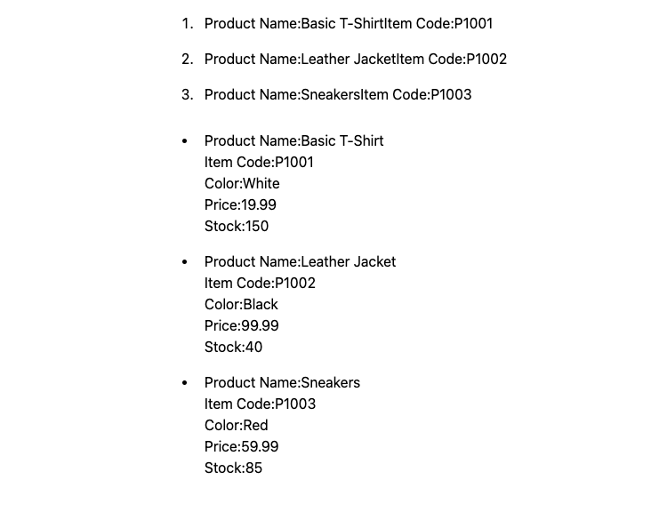

# Layout component design pattern

## Table of contents

- [Introduction](#introduction)
- [Main concerns of the components and the idea behind the pattern](#main-concerns-of-the-components-and-the-idea-behind-the-pattern)
- [Examples](#examples)
- [Project Setup](#project-setup)
- [Split screens](#split-screens)
  - [Practice Scenario:](#practice-scenario)
  - [Optimizing the split screen layout part 1: Dynamic flex property](#optimizing-the-split-screen-layout-part-1-dynamic-flex-property)
  - [Optimizing the split screen layout part 2: Pass components as children](#optimizing-the-split-screen-layout-part-2-pass-components-as-children)
- [List items](#list-items)
  - [Practice Scenario:](#practice-scenario-1)
  - [Thinking process:](#thinking-process)
  - [Optimizing the list items layout part 1: Dynamic list items](#optimizing-the-list-items-layout-part-1-dynamic-list-items)
- [Modals](#modals)
  - [Practice Scenario:](#practice-scenario-2)
  - [Thinking process:](#thinking-process-1)
  - [Optimizing the modal layout part 1: Make it more readable](#optimizing-the-modal-layout-part-1-make-it-more-readable)

## Main concerns of the components and the idea behind the pattern

Helping us to arrange other components that we create on the page, and the main idea is layout components shouldn't know where they are being displayed.

### Examples

1. [x] Split screens.
2. [x] Modals.
3. [x] List items.

### Project Setup

- Inside the `split-screen` directory, run the following command to install the dependencies:

```bash
# npm 7+, extra double-dash is needed:
npm create vite@latest ./ -- --template react-ts

# yarn
yarn create vite ./ --template react-ts

# pnpm
pnpm create vite ./ --template react-ts

# bun
bun create vite ./ --template react-ts
```

- Install Tailwind CSS:

```bash
npm install tailwindcss@latest postcss@latest autoprefixer@latest
npx tailwindcss init -p
```

- Add the following to the `tailwind.config.js` file:

```js
module.exports = {
  mode: "jit",
  purge: ["./index.html", "./src/**/*.{js,jsx,ts,tsx}"],
  darkMode: false, // or 'media' or 'class'
  theme: {
    extend: {},
  },
  variants: {
    extend: {},
  },
  plugins: [],
};
```

- Add the following to the `index.css` file:

```css
@tailwind base;
@tailwind components;
@tailwind utilities;
```

---

### Split screens

#### Practice Scenario:

Imagine you are developing a product display application, where you need to show product images and detailed descriptions simultaneously. You can use the Split Screen mode, displaying product images on the left and product details and action buttons on the right. This allows users to view images while reading information

From above scenario, here is an example from real world:


- The left side of the screen displays the product image.
- The right side of the screen displays the product details.

Here are the basic implementation:

**Desktop**


**Mobile**


**Check the `split-screen` directory for the implementation.**

#### Optimizing the split screen layout part 1: Dynamic flex property

From time to time, we may need to adjust layout, so it wouldn't be a good idea to give them a fixed value for the flex property, so the better way to amend `flex:{number}` to whatever we need.

```tsx
interface productSplitScreenProps {
  left: React.ComponentType;
  right: React.ComponentType;
}

export default function ProductSplitScreen({
  left: LeftScreen,
  right: RightScreen,
}: productSplitScreenProps) {
  return (
    <div className="flex flex-col lg:flex-row gap-6 ">
      <div className="flex-1">
        <LeftScreen />
      </div>
      <div className="flex-1">
        <RightScreen />
      </div>
    </div>
  );
}
```

Back to `App.tsx`, let's add additional props to the `ProductSplitScreen` component:

```tsx
// App.tsx
function App() {
  return (
    <main className="w-full max-w-full h-full px-4 md:max-w-[900px] lg:max-w-[1200px] xl:max-w-[1440px]">
      <h1 className="text-2xl font-bold pb-2">...</h1>
      <ProductSplitScreen
        left={ProductImage}
        right={ProductDetails}
        leftWeight={3}
        rightWeight={1}
      />
    </main>
  );
}
```

Then update the `ProductSplitScreen` component:

```tsx
// product-split-screen.tsx
interface productSplitScreenProps {
  left: React.ComponentType;
  right: React.ComponentType;
  leftWeight: number;
  rightWeight: number;
}

export default function ProductSplitScreen({
  left: LeftScreen,
  right: RightScreen,
  leftWeight,
  rightWeight,
}: productSplitScreenProps) {
  return (
    <div className="flex flex-col lg:flex-row gap-6 ">
      <div className={`flex-${leftWeight}`}>
        <LeftScreen />
      </div>
      <div className={`flex-${rightWeight}`}>
        <RightScreen />
      </div>
    </div>
  );
}
```

> flex-1 is a shorthand for flex: 1 1 0%, which means it will take up the remaining space. The flex property is a shorthand for `flex-grow`, `flex-shrink`, and `flex-basis`.

#### Optimizing the split screen layout part 2: Pass components as children

We can also pass `ProductImage` and `ProductDetails` as children to the `ProductSplitScreen` component as this is more readable and easier to understand.

```tsx
// App.tsx
<ProductSplitScreen leftWeight={1} rightWeight={3}>
  <ProductImage />
  <ProductDetails />
</ProductSplitScreen>
```

Then update the `ProductSplitScreen` component:

```tsx
// product-split-screen.tsx
interface productSplitScreenProps {
  children: React.ReactNode;
  leftWeight: number;
  rightWeight: number;
}

export default function ProductSplitScreen({
  children,
  leftWeight = 1,
  rightWeight = 1,
}: productSplitScreenProps) {
  const [left, right] = React.Children.toArray(children);

  return (
    <div className="flex flex-col lg:flex-row gap-6 ">
      <div className={`flex-${leftWeight}`}>{left}</div>
      <div className={`flex-${rightWeight}`}>{right}</div>
    </div>
  );
}
```

By implementing the above changes, we can pass props inside the `ProductImage` and `ProductDetails` easily, compare to the previous implementation, we would need to add props in `App.tsx`, and pass as props inside `ProductSplitScreen` component, then to the `ProductImage` and `ProductDetails` component.

```tsx
// App.tsx
function App() {
  return (
    <main className="w-full max-w-full h-full px-4 md:max-w-[900px] lg:max-w-[1200px] xl:max-w-[1440px]">
      <h1 className="text-2xl font-bold pb-2">購買 Apple Watch Series 9</h1>
      <ProductSplitScreen leftWeight={1} rightWeight={3}>
        <ProductImage />
        <ProductDetails
          title="錶殼。 請從材質和外觀開始選擇。"
          material="鋁金屬"
          option="可選擇 GPS 或 GPS + 行動網路"
          price="NT$13,500 起"
          description="拉絲外觀搭配 Ion-X 強化玻璃顯示器。"
        />
      </ProductSplitScreen>
    </main>
  );
}
```

```tsx
// ProductDetails.tsx
interface ProductDetailsProps {
  title: string;
  material: string;
  option: string;
  price: string;
  description: string;
}

export default function ProductDetails({
  title,
  material,
  option,
  price,
  description,
}: ProductDetailsProps) {
  return (
    <div>
      <h2>{title}</h2>
      <div>
        <div>
          <h3>{material}</h3>
          <span>{option}</span>
        </div>
        <div>
          <span>{price}</span>
        </div>
      </div>
      <div>
        <span>{description}</span>
      </div>
    </div>
  );
}
```

---

### List items

List is a very common component in web, there are order list, unordered list, and some of lists may have different styles, such as list items with icons, list items with images, etc.

#### Practice Scenario:

From my experience, I think the most common and complicated list is when it comes to display terms of use like below:


#### Thinking process:

1. We need a sort of a container that allows us to pass different types of list items to it.
2. the containers should be able to handle different types of list items, such as list items with icons, list items with images, etc.
3. The list items should only be displayed content.

**Check the `list-items` directory for the implementation.**

#### Optimizing the list items layout part 1: Dynamic list items

I think it would make list items more flexible if we can pass list style and start number as props, so I've amended the code like below:

```tsx
// App.tsx
function App() {
  return (
    <main className="w-full max-w-full px-4 mt-4 lg:max-w-[1200px] mx-auto">
      <div className="flex flex-col gap-3">
        <OrderList
          start={1}
          listStyle="list-decimal"
          items={productInfo}
          sourceName="product"
          itemComponent={MinProductInfo}
        />

        <UnorderList
          listStyle="list-disc"
          items={productInfo}
          sourceName="product"
          itemComponent={FullProductInfo}
        />
      </div>
    </main>
  );
}
```

Here is what is looks like:



So if need to amend the order of the list items, let's say I want the list starts from 5, I can simply change the `start` prop to 5.

```tsx
// App.tsx
<OrderList
  start={5}
  listStyle="list-decimal"
  items={productInfo}
  sourceName="product"
  itemComponent={MinProductInfo}
/>
```

---

### Modals

Modals are a very common UI in web development, it is used to display content on top of the current page with some sort of warning, message, or confirmation, in real life cases, for example an e-commerce website, or food ordering website, it may have lot of alert messages, or confirmation messages.

Making a modal component that receives titles, content, and buttons as props, and the modal should be able to handle different types of buttons, such as primary, secondary, and danger buttons.

#### Practice Scenario:

Let's say we are building a modal for login and delete account, the modal should have a title, content, and buttons, and the modal should be able to handle different types of buttons.

For login, the common alert messages would be like below:

```json
// login.json
{
  "title": "Login",
  "content": "Please enter your username and password",
  "buttons": [
    {
      "type": "primary",
      "text": "Login"
    },
    {
      "type": "secondary",
      "text": "Cancel"
    }
  ]
}
```

For delete account, the common alert messages would be like below:

```json
// delete-account.json
{
  "title": "Delete Account",
  "content": "Are you sure you want to delete your account?",
  "buttons": [
    {
      "type": "danger",
      "text": "Delete"
    },
    {
      "type": "secondary",
      "text": "Cancel"
    }
  ]
}
```

#### Thinking process:

1. A modal is a component to show important message or confirmation, therefore it needs to be bale to handle different types of buttons or content.
2. First of all, create a `Modal` component that receive props for title, content, and buttons.

**Check the `modals` directory for the implementation.**

#### Optimizing the modal layout part 1: Make it more readable

We can extract part of the modal to be a separate component, so it would be more readable and easier to understand, for example:

```tsx
// Extract modal overlay and modal content body to separate components

// modal-overlay.tsx
export default function ModalOverlay({
  children,
}: {
  children: React.ReactNode;
}) {
  return (
    <div className="absolute bg-black/70 top-0 left-0 z-40 w-full h-screen">
      {children}
    </div>
  );
}

// modal-body.tsx
export default function ModalBody({ children }: { children: React.ReactNode }) {
  return (
    <div className="bg-white mx-auto my-[10%] py-5 px-10 w-[30%] rounded-md">
      {children}
    </div>
  );
}
```

And import them in the `Modal` component:

```tsx
export default function Modal({
  children,
  rightButton,
  leftButton,
  onLeftButton,
  onRightButton,
}: modalProps) {
  const renderButtonBg = (type?: string) => {
    switch (type) {
      case "primary":
        return "bg-indigo-800 text-white ";
      case "secondary":
        return "bg-gray-300";
      default:
        return "bg-gray-300";
    }
  };
  return (
    <>
      <ModalOverlay>
        <ModalBody>
          <div
            className="flex flex-col items-center
          gap-7"
          >
            ...
          </div>
        </ModalBody>
      </ModalOverlay>
    </>
  );
}
```

Something like `shadcn` below:

```tsx
<AlertDialog>
  <AlertDialogTrigger>Open</AlertDialogTrigger>
  <AlertDialogContent>
    <AlertDialogHeader>
      <AlertDialogTitle>Are you absolutely sure?</AlertDialogTitle>
      <AlertDialogDescription>
        This action cannot be undone. This will permanently delete your account
        and remove your data from our servers.
      </AlertDialogDescription>
    </AlertDialogHeader>
    <AlertDialogFooter>
      <AlertDialogCancel>Cancel</AlertDialogCancel>
      <AlertDialogAction>Continue</AlertDialogAction>
    </AlertDialogFooter>
  </AlertDialogContent>
</AlertDialog>
```
