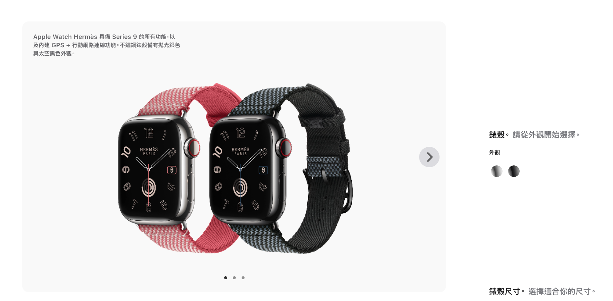
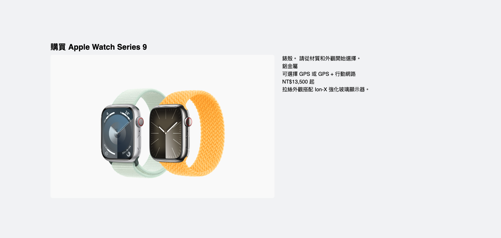
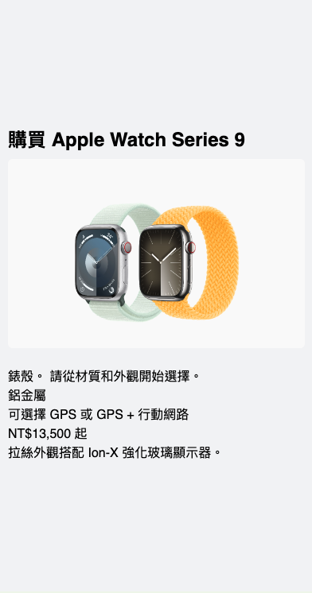

# Layout component design pattern

## Main concerns of the components and the idea behind the pattern

Helping us to arrange other components that we create on the page, and the main idea is layout components shouldn't know where they are being displayed.

### Examples

1. Split screens.
2. Modals.
3. List items.
4. Holy grail layout.
5. Real world case.

### Project Setup

- Inside the `split-screen` directory, run the following command to install the dependencies:

```bash
# npm 7+, extra double-dash is needed:
npm create vite@latest ./ -- --template react-ts

# yarn
yarn create vite ./ --template react-ts

# pnpm
pnpm create vite ./ --template react-ts

# bun
bun create vite ./ --template react-ts
```

- Install Tailwind CSS:

```bash
npm install tailwindcss@latest postcss@latest autoprefixer@latest
npx tailwindcss init -p
```

- Add the following to the `tailwind.config.js` file:

```js
module.exports = {
  mode: "jit",
  purge: ["./index.html", "./src/**/*.{js,jsx,ts,tsx}"],
  darkMode: false, // or 'media' or 'class'
  theme: {
    extend: {},
  },
  variants: {
    extend: {},
  },
  plugins: [],
};
```

- Add the following to the `index.css` file:

```css
@tailwind base;
@tailwind components;
@tailwind utilities;
```

---

### Split screens

**Practice Scenario:**

Imagine you are developing a product display application, where you need to show product images and detailed descriptions simultaneously. You can use the Split Screen mode, displaying product images on the left and product details and action buttons on the right. This allows users to view images while reading information

From above scenario, here is an example from real world:



- The left side of the screen displays the product image.
- The right side of the screen displays the product details.

Here are the basic implementation:

**Desktop**



**Mobile**



> Check the `split-screen` directory for the implementation.

#### Optimizing the split screen layout

From time to time, we may need to adjust layout, so it wouldn't be a good idea to give them a fixed value for the flex property, so the better way to amend `flex:{number}` to whatever we need.

```tsx
interface productSplitScreenProps {
  left: React.ComponentType;
  right: React.ComponentType;
}

export default function ProductSplitScreen({
  left: LeftScreen,
  right: RightScreen,
}: productSplitScreenProps) {
  return (
    <div className="flex flex-col lg:flex-row gap-6 ">
      <div className="flex-1">
        <LeftScreen />
      </div>
      <div className="flex-1">
        <RightScreen />
      </div>
    </div>
  );
}
```

Back to `App.tsx`, let's add additional props to the `ProductSplitScreen` component:

```tsx
function App() {
  return (
    <main className="w-full max-w-full h-full px-4 md:max-w-[900px] lg:max-w-[1200px] xl:max-w-[1440px]">
      <h1 className="text-2xl font-bold pb-2">...</h1>
      <ProductSplitScreen
        left={ProductImage}
        right={ProductDetails}
        leftWeight={3}
        rightWeight={1}
      />
    </main>
  );
}
```

Then update the `ProductSplitScreen` component:

```tsx
interface productSplitScreenProps {
  left: React.ComponentType;
  right: React.ComponentType;
  leftWeight: number;
  rightWeight: number;
}

export default function ProductSplitScreen({
  left: LeftScreen,
  right: RightScreen,
  leftWeight,
  rightWeight,
}: productSplitScreenProps) {
  return (
    <div className="flex flex-col lg:flex-row gap-6 ">
      <div className={`flex-${leftWeight}`}>
        <LeftScreen />
      </div>
      <div className={`flex-${rightWeight}`}>
        <RightScreen />
      </div>
    </div>
  );
}
```

> flex-1 is a shorthand for flex: 1 1 0%, which means it will take up the remaining space. The flex property is a shorthand for `flex-grow`, `flex-shrink`, and `flex-basis`.

---

### Modals
